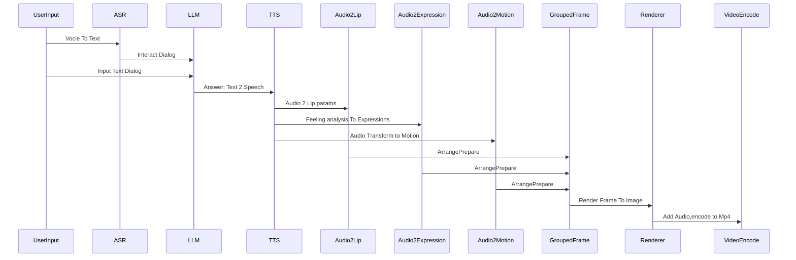

# 彭云
## Tencent
## Main Focus
3d Human reconstruct,Text2Video,Image2Human,Image2Motion etc...

some useful codes for better work with ue.

Current Main Digital Human Interact Process

Image/Video to 3d assets,make benifit of this assets is my main point.

git clone https://chromium.googlesource.com/libyuv/libyuv
