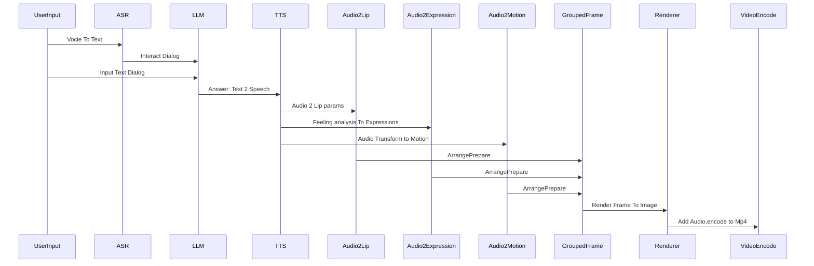

# 彭云
## Tencent
## Main Focus
3d Human reconstruct,Text2Video,Image2Human,Image2Motion etc...

## Self Introduce
专注于3d相关工作，从PBR渲染，物理模拟到视觉重建等相关工作。
一开始做GIS的大场景数据处理(google地球金字塔数据结构)，地面的shp数据处理到转换为3d建筑等。对3d多边形处理以及几何体构建等。同时也对2d空间上面的矢量进行渲染处理。
渲染方面，涉及到方方面面，场景人物，等都有涉猎，主要是pc端上面，包括D3D,OpenGL等API。
后续转做移动端上面渲染，VR方面，借力Occulus 开源代码，研发自己的陀螺仪驱动逻辑，在通用手机上面实现旋转控制的稳定性。
在此阶段对手机性能分析，trace等有一定深入理解，将渲染模块控制在2MB以内，集成到手机app后相比使用unity等引擎包体积缩小几倍。
后转过去专注于3d数字人的处理。包括3d姿态估计，3d人体人脸头发服装重建等方面的工作，结合LLM，ASR，TTS等构建完全态3D数字人助手。
Focus On 3D work.specially on Human 3d work. C++,Python

## Contact With Me
如果需要交流可以和我联系，3d相关的人生阅历还是很丰富的。现在AI编程大行其道。感觉能力边界有了质的扩展。

some useful codes for better work with ue.

Current Main Digital Human Interact Process

Image/Video to 3d assets,make benifit of this assets is my main point.

git clone https://chromium.googlesource.com/libyuv/libyuv
